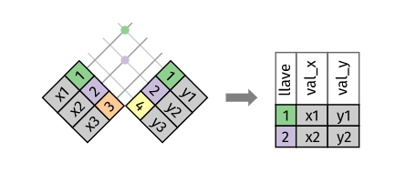
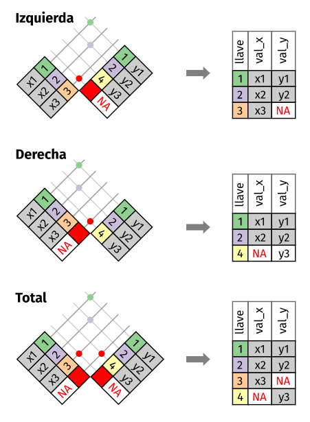
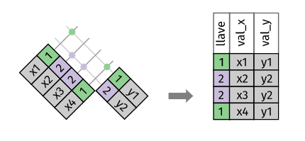
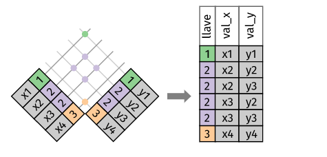
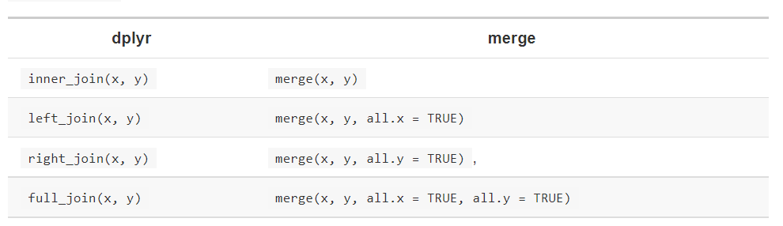
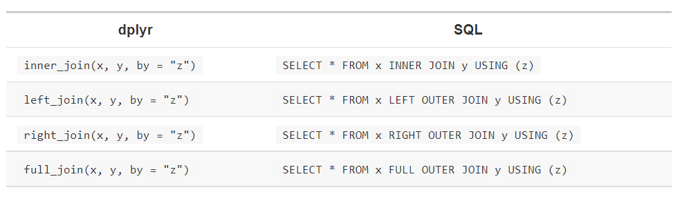

```{r setup, include=FALSE}
knitr::opts_chunk$set(echo = TRUE)
library(tidyverse)
library(datos)
```

## Repaso
Una clave primaria identifica únicamente una observación en su propia tabla.
Una clave foránea únicamente identifica una observación en otra tabla.
Una forma de verificar cuando una clave es primaria es usando count() con las claves primarias y buscar las entradas con n mayor a uno. De esta manera se verifica la forma única de observación:
```{r datasets, echo=FALSE}
vuelos
aviones
aerolineas
aeropuertos
clima
```


```{r kp_clima, echo=FALSE}
aviones %>%
  count(codigo_cola) %>%
  filter(n > 1)

clima %>%
  count(anio, mes, dia, hora, origen) %>%
  filter(n > 1)
```
## Uniones de transformación
Una unión de transformación te permite combinar variables a partir de dos tablas. Primero busca coincidencias de observaciones de acuerdo a sus claves y luego copia las variables de una tabla en la otra.

Con select(), seleccionar un subconjunto de vuelos que contenga como variables a las claves foraneas. 

```{r subconjunto_vuelos, echo=FALSE}
vuelos2<- vuelos %>%
 select(anio:dia, hora, origen, destino, codigo_cola, aerolinea)
#View(vuelos)
vuelos2


```

Imaginemos que se quiere incluir el nombre completo de cada aerolínea en vuelos2. Para ello combinamos los datos de aerolineas y vuelos2 con left_join():

```{r leftjoin}
vuelos2 %>%
  select(-origen, -destino) %>%
  left_join(aerolineas, by = "aerolinea")
```

Hagamos otro ejemplo:
```{r leftjoin2}
vuelos2 %>%
  select(-destino, -codigo_cola, -aerolinea) %>%
  left_join(clima, by = c('anio', 'mes', 'dia', 'hora', 'origen'))
```

En el primer caso, se podría obtener el mismo resultado usando mutate() junto a las operaciones de filtro de R base.

```{r mutate}
vuelos2 %>%
  select(-origen, -destino) %>%
  mutate(nombre = aerolineas$nombre[match(aerolinea, aerolineas$aerolinea)])
```
Vemos que algo simple, pero si sólo se agrega una variable. En otras palabras, cuando se tienen que agregar múltiples variables
esto para ser un poco más complicado al momento de enteder lo que se quiere hacer. 

## Uniones
Consideremos el siguiente ejemplo:

```{r ejemplo_uniones, echo=FALSE}
x <- tribble(
  ~key, ~val_x,
  1, "x1",
  2, "x2",
  3, "x3"
)
y <- tribble(
  ~key, ~val_y,
  1, "y1",
  2, "y2",
  4, "y3"
)


```

Para unir filas entre tablas, usaremos las "claves".
En la unión que mostramos, las coincidencias se indican con puntos. El número de puntos es igual al número de coincidencias y al número de filas en la salida.
{width=60%}

### Unión interior (intersección)

El output de una unión interior es un nuevo data frame que contiene la clave, los valores de x y los valores de y. Usamos by (según) para indicar a dplyr qué variable es la clave:

```{r union_interior, echo=FALSE}
x %>%
  inner_join(y, by = "key")
```

La propiedad más importante de una unión interior es que las filas no coincidentes no se incluyen en el resultado. Esto significa que generalmente las uniones interiores no son apropiadas para su uso en el análisis de datos dado que es muy fácil perder observaciones.


### Uniones exteriores 

Se tiene 3 tipos de uniones exteriores:

{width=60%}

La unión que más frecuentemente se usa es la unión izquierda: úsala cuando necesites buscar datos adicionales en otra tabla, dado que preserva las observaciones originales incluso cuando no hay coincidencias. 


### Claves duplicadas

Hay dos posibilidades:

1. Una tabla tiene claves duplicadas. Esto es útil cuando quieres agregar información adicional dado que típicamente existe una relación uno a muchos.

{width=60%}

```{r duplicadas_unomuchos, echo=FALSE}
x <- tribble(
 ~key, ~val_x,
 1, "x1",
 2, "x2",
 2, "x3",
 1, "x4"
)
y <- tribble(
 ~key, ~val_y,
 1, "y1",
 2, "y2"
)
duplicadauno<-left_join(x, y, by = "key")
duplicadauno
```
2. Ambas tablas tienen claves duplicadas. Esto es usualmente un error debido a que en ninguna de las tablas las claves identifican de manera única una observación.

{width=60%}


```{r duplicadas2, echo=FALSE}
 x <- tribble(
 ~key, ~val_x,
 1, "x1",
 2, "x2",
 2, "x3",
 3, "x4"
  )
  y <- tribble(
 ~key, ~val_y,
 1, "y1",
 2, "y2",
 2, "y3",
 3, "y4"
  )
 duplicada2<- left_join(x, y, by = "key")
 duplicada2
```

### Definiendo las columnas claves

Los pares de tablas siempre se han unido de acuerdo a una única variable y esa variable tiene el mismo nombre en ambas tablas. Esta restricción se expresa de la forma by = "key".

Por defecto, by = NULL, usa todas las variables que aparecen en ambas tablas, lo que se conoce como unión natural. 

```{r defecto, echo=FALSE}
vuelos2 %>%
  left_join(aerolineas)
```

Un vector de caracteres, by = "x". Esto es similar a una unión natural, pero usa algunas de las variables comunes. Por ejemplo, vuelos y aviones tienen la variable anio, pero esta significa cosas distintas en cada tabla por lo que queremos unir por codigo_cola.

```{r vector, echo=FALSE}
#vuelos2 %>% left_join(aviones)
vuelos2 %>%
  left_join(aviones, by="codigo_cola")
```

Un vector de caracteres con nombres: by = c("a" = "b"). Esto va a unir la variable a en la tabla x con la variabla b en la tabla y. Las variables de x se usarán en el output.

```{r vector_caract, echo=FALSE}
vuelos2 %>%
 left_join(aeropuertos, by="codigo_aeropuerto")

#vuelos2 %>%
 # left_join(aeropuertos)

vuelos2 %>%
  left_join(aeropuertos, by=c("origen" = "codigo_aeropuerto"))

vuelos2 %>%
  left_join(aeropuertos, by=c("destino"="codigo_aeropuerto"))
```


## Ejercicios

1. Calcula el atraso promedio por destino y luego une los datos en aeropuertos para que puedas mostrar la distribución espacial de los atrasos. Esta es una forma fácil de dibujar un mapa de los Estados Unidos:
```{r, }
aeropuertos %>%
  semi_join(vuelos, c("codigo_aeropuerto" = "destino")) %>%
  ggplot(aes(longitud, latitud)) +
  borders("state") +
  geom_point() +
  coord_quickmap()
```
Quizás quieras usar size o colour para editar los puntos y mostrar el atraso promedio de cada aeropuerto.


```{r atraso_promedio}
mean_atraso <- vuelos %>%
  group_by(destino) %>%
  summarise(atraso=mean(atraso_llegada, na.rm=TRUE)) %>%
  inner_join(aeropuertos, c(destino="codigo_aeropuerto"))


mean_atraso %>%
  ggplot(aes(longitud, latitud, colour=atraso)) +
  borders("state") +
  geom_point() +
  coord_quickmap()
```


2. Agrega la ubicación de origen y destino (por ejemplo, latitud y longitud) a vuelos.

```{r ubicacion}
location_airports<- aeropuertos %>%
  select(codigo_aeropuerto, latitud, longitud)

vuelos %>%
  select(anio, mes, dia, hora, origen, destino) %>%
  left_join(location_airports, c("origen"="codigo_aeropuerto")) %>%
  left_join(location_airports, c("destino"="codigo_aeropuerto"))
```

3. ¿Existe una relación entre la antiguedad de un avión y sus atrasos?

Depende de los atrasos, si son de llegada o salida. Para poder analizar la antiguedad deberíamos unir los datos de aviones con los vuelos. 

```{r antiguedad}
aviones2<- select(aviones, codigo_cola, anio_fabricacion=anio)

vuelos %>% 
  inner_join(aviones2, by="codigo_cola") %>%
  mutate(antiguedad = anio - anio_fabricacion) %>%
  filter(!is.na(antiguedad)) %>%
  group_by(antiguedad) %>%
  summarise(prom_atraso_llegada=mean(atraso_llegada, na.rm=TRUE),
            prom_atraso_salida=mean(atraso_salida, na.rm=TRUE)) 

  
```

4. ¿Qué condiciones climáticas hacen más probables los atrasos?
Las condiciones climáticas que hacen más probables los atrasos son las tormentas de lluvias fuertes. 

```{r climaticas}
vuelo_clima <- vuelos %>%
  inner_join(clima, by = c(
    "origen",
    "anio",
    "mes",
    "dia",
    "hora"
  ))


vuelo_clima %>%
  group_by(precipitacion) %>%
  summarise(atraso = mean(atraso_llegada, na.rm = TRUE)) %>%
  ggplot(aes(x = precipitacion, y = atraso)) +
  geom_line() +
  geom_point()

```


5. ¿Qué sucedió el día 13 de junio de 2013? Muestra el patrón espacial de los atrasos. Luego, usa un buscador para encontrar referencias cruzadas con el clima.


```{r}
vuelos %>%
  filter(anio == 2013, mes == 6, dia == 13) %>%
  group_by(destino) %>%
  summarise(atraso = mean(atraso_salida, na.rm = TRUE)) %>%
  inner_join(aeropuertos, by = c("destino" = "codigo_aeropuerto")) %>%
  ggplot(aes(y = latitud, x = longitud, size = atraso, colour = atraso)) +
  borders("state") +
  geom_point() +
  coord_quickmap() +
  scale_colour_viridis_c()
```

## Otras implementaciones

La ventaja de los verbos específicos de dplyr es que muestran de manera clara la intención del código: la diferencia entre las uniones es realmente importante pero se esconde en los argumentos de merge().



También podemos ver las comparaciones, o similitudes, con SQL:



Unir distintas variables entre tablas, por ejemplo inner_join(x, y, by = c("a" = "b")), usa una sintaxis ligeramente distinta en SQL: SELECT * FROM x INNER JOIN y ON x.a = y.b. Como la sintaxis sugiere, SQL soporta un rango más amplio de tipos de uniones que dplyr, ya que puedes conectar tablas usando restricciones distintas a las de igualdad.
